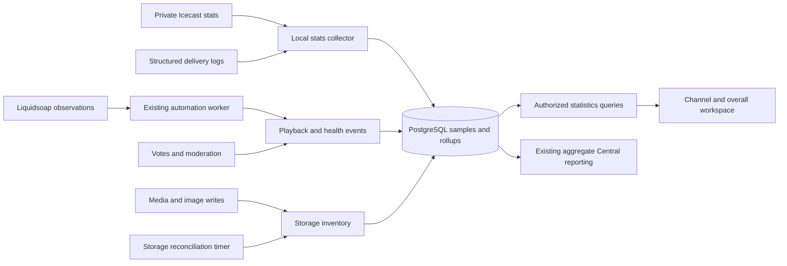

# Channel and overall station statistics plan

Status: core statistics dashboard, collectors, migration and world map deployed on 2026-09-17 after the Icecast 2.5 upgrade. See the [implemented behavior and operating guide](statistics.md) for shipped functionality and measurement limits. This document retains the broader design roadmap, including future session, exposure and delivery analysis. See also the [engine upgrade record](icecast-upgrade.md).

## Revised baseline after Icecast 2.5.0

The engine upgrade and trusted Nginx forwarding are complete. Public-stream tests verified real client addresses and rejection of forged forwarding headers. Remove the old upgrade-versus-bridge decision from the implementation path; use the installed engine's private XML endpoints directly through the new collector.

| Source | Collector responsibility | Dashboard output |
| --- | --- | --- |
| Icecast `/admin/stats` | Poll all managed mounts; retain counts, source/server epochs and transfer-counter deltas | Current/average/peak listeners, listener hours, stream transfer and availability |
| Icecast `/admin/listclients?mount=...` | Observe connection IDs, client addresses, connected time and user agents; resolve coarse location locally | Live listener map, observed listening sessions, historic geographic reach |
| Public-page presence events | Track expiring browser sessions separately, with channel attribution | Website visitors and their live/historical map |
| Freo playback and feedback records | Aggregate confirmed starts and accepted preferences; add missing historical transitions | Songs/artists, likes/dislikes, approval and programming comparisons |
| Media files and database images | Inventory stored objects and reconcile retained/deleted files | Current storage, breakdowns, growth and capacity context |
| Existing worker/engine observations | Persist selected health changes and delivery outcomes | Reliability, fallback/silence incidents and scheduled-event performance |

Use structured endpoint responses rather than the Icecast HTML interface. Mount counts are authoritative for sampled concurrency; client-list observations enrich them with location/session details. The calls are not atomic: tolerate arrivals/departures between responses and show geographic coverage separately rather than forcing counts to agree. Icecast still resets source counters, so persistent history and restart handling remain Freo's responsibility. See [Icecast statistics](https://icecast.org/docs/icecast-latest/server_stats/) and [private administration API](https://icecast.org/docs/icecast-latest/admin_interface/).

The next deliverable is the independent local collector, including geographic enrichment as soon as a GeoIP database is configured. Start audience, transfer and coarse geographic history before completing the visual workspace. The upgrade itself has not started long-term collection. GeoIP database installation/update credentials remain a setup dependency; configure those through restricted server settings, not public pages or source control. Local collector lookup gives stream listeners and website visitors one consistent geographic dataset.

## Scope and product direction

Build one statistics workspace with an **All channels** scope and individual channel scopes. Freo currently represents a channel with the `Station` model; overall means all managed channels in this installation. A separate organization hierarchy or cross-installation dashboard is outside this change.

Provide `/admin/stats` and `/admin/stations/<slug>/stats`, linked from the sidebar and station cards. Use the existing authenticated admin boundary, with an explicit `can_view_statistics(user, station)` permission hook. Current users are global administrators; future channel roles can restrict the same queries and exports.

The workspace has six tabs: Overview, Audience, Music, Engagement, Resources, Reliability. Keep the overview concise, with detailed tables and charts behind the tabs. All requested core metrics and the live/historical world map belong in the initial complete release; advanced session analysis can follow separately.

## Existing foundations and gaps

| Area | Existing implementation | Required work |
| --- | --- | --- |
| Current audience | `services/broadcast_status.py` polls local Icecast JSON with a five-second cache; `LiveQueueSnapshot` exposes listeners | Durable collection independent of playout and Central registration; freshness and coverage |
| Listener geography | Icecast 2.5 private client lists with verified real client-address forwarding | Local GeoIP lookup, short-lived session observations, geographic aggregates and live/historical maps |
| Audience history | `services/central_api/metrics.py` integrates listener time and stores hourly averages/peaks | Existing rows expire after seven days, and sampling follows registration in `Reporter.tick`; introduce local long-term analytics |
| Airplay | `SelectionDecision.status == 'started'`, `started_at`, track/category/clock/rotation references; `services/airplay.py` counts confirmed starts | Date-filtered rankings, artist aggregation, durable display/context snapshots and period comparisons |
| Likes/dislikes | `ListenerVote`, `ListenerFeedbackEvent`, `player.vote_stats`, moderation and private comments | Period-aware feedback ledger, moderation semantics, trends and sample-size-aware rankings |
| Audio storage | `Track.file_size_bytes`, `ImagingAsset.file_size_bytes`, controlled storage keys | Reconciliation with actual files, growth snapshots, retained/deleted file accounting |
| Images | Filesystem artwork plus database `MusicArtwork.image`, `StationLogo.image` and `.thumbnail`, `StationPlayerAsset.image` | Byte metadata for every stored image variant; deduplicate references and include retained images |
| Shared music | `services/availability.py`; track owner differs from channels allowed to use it | Separate owned storage from accessible library totals; avoid counting shared files repeatedly |
| Operational data | Worker heartbeat, live queue/mixer snapshots, microphone state, events, blocks, traffic placements and as-run history | Persist selected health transitions and aggregate delivery metrics |
| UI | Flask/Jinja, native JavaScript, existing cards/tables and theme tokens | Reusable chart/card/filter components consistent with the current app |

Station deletion retains media and history; permanent song deletion retains song identity and the original size field. Therefore neither a naive sum of every size field nor a sum of channel library totals represents physical storage correctly.

## Screen design

Shared toolbar: scope selector, date presets, custom range, timezone, comparison toggle, export, and last-updated/coverage indicator. Preserve filters in the URL and when opening a song or channel detail.

Date presets: **Live, Past 24 hours, Yesterday, Past 7 days, Past 30 days, Past 365 days**, plus **This month, This year, Custom**. Bandwidth also has its own clearly labeled **This month / This year / Since tracking began** switch. Storage cards show **current** usage even when historical charts use the selected range.

Default to Past 24 hours, with current audience always visible. Calendar ranges use the channel timezone; All channels uses a single displayed reporting timezone, default UTC. Show exact range boundaries. Yesterday follows local calendar boundaries, including daylight-saving changes. Compare partial current periods with equally elapsed previous periods. Omit percentage growth when the prior value is zero or coverage is insufficient.

```text
Statistics       [All channels v] [Past 24 hours v] [Compare] [Export]
Overview  Audience  Music  Engagement  Resources  Reliability

[Listening now] [Average / peak] [Listener hours] [Confirmed plays]
[Transfer this month] [Stored media + images] [Approval] [Stream uptime]

[Audience timeline, previous period, optional on-air annotations       ]
[World map: Online now / Historical reach | Listeners / Visitors       ]
[Top songs / artists                   ] [Likes / dislikes / approval ]
[Channels: audience, growth, usage, health, click to drill down        ]
```

Use responsive metric cards with sparklines, line/area charts, ranked horizontal bars, a day/hour heatmap, storage composition bars, and sortable paginated tables with artwork. Use the existing light/dark themes and semantic colors. Render charts with reusable native SVG components and server-bounded data arrays; no frontend framework migration is needed. Provide keyboard-accessible controls, accessible chart descriptions and equivalent data tables, reduced motion, and meaningful loading, empty, stale and error states. Avoid tooltip-only facts and unexplained composite scores.

## Metric contracts

### Audience

- **Listening now:** current stream connections per managed mount. Label this as connections in the help text; it is not a verified count of individual people.
- **Average listeners:** integrated listener-seconds divided by observed seconds. Do not average averages.
- **Peak listeners:** largest sampled concurrent count inside the selected range. An engine lifetime peak is a different metric and must not substitute for it.
- **Listener hours:** integrated listener-seconds / 3,600, with sampling precision and coverage disclosed.
- **Audience chart and heatmap:** sampled concurrency, previous-period comparison, observed gaps and peak time.
- **Channel comparison:** current/average/peak audience, listener-hour share and change. An overall peak is the maximum simultaneous sum across channels, never the sum of separate channel peaks.
- **Programs/dayparts:** audience and listener hours aligned with actual schedule/program observations; distinguish planned schedule from observed playout.

Collect all managed mounts in a common polling cycle. Preserve an All channels sample/rollup at collection time so simultaneous peaks remain available after raw samples expire. Exclude the diagnostic `freo-test` mount. Show a partial total when any channel is unknown, identifying coverage; do not silently fill missing channels with zero. Historical overall totals include archived channels that contributed in that period, with an archived filter for drill-down.

Polling failures are unknown; a successful complete mount response with an absent mount can mean offline. Valid offline observations are zero listeners. Do not extrapolate through outages or across source epochs. Integrate adjacent valid samples only within a bounded gap (initially twice the configured poll interval plus a small scheduling tolerance).

Unique people, returning listeners, geography, listening devices and session duration require additional data. They are not inferred from listener-count samples. Session counts are connections; reconnects may create new sessions. The required map introduces coarse location collection and website presence below; deeper retention/device analytics can follow separately.

### World map: online users and historical reach

Include a prominent world map on Overview and an expanded map in Audience, for both individual channels and All channels. Provide **Online now / Historical reach** controls, with the historical range following the dashboard and an additional **All time — since tracking began** option. Preserve map mode and scope in the URL.

Provide a separate **Stream listeners / Website visitors** selector. Default to Stream listeners. A site visit is not necessarily a listening session, and external radio players can listen without visiting the site. Do not add the two populations together and call them unique people.

- **Online now:** clustered regional/city markers sized by active connections or active browser sessions; update every 15 seconds. Include current connections, located connections, unknown locations and countries represented. Avoid distracting continuous animation; optionally highlight recent changes with reduced-motion support.
- **Historical reach:** country shading and clustered place markers representing recorded sessions/visits in the selected period; expose a weight toggle for listening hours where supported. All time preserves every observed coarse place even after detailed sessions expire. Show first seen, last seen and total recorded sessions on location selection.
- **Drill-down:** world → country → region/city, with a synchronized sortable list of locations. Selecting a place filters its timeline and channel breakdown. All channels merges identical geographic place IDs and combines channel activity; it does not deduplicate unknown human identities.
- **Presentation:** zoom/reset/fullscreen controls, clear intensity legend, dark/light styles, touch support, keyboard-accessible location list and a table fallback when WebGL is unavailable. Distinguish zero activity, no geographic data yet, collector unavailable and unmappable traffic.

Use a pinned, locally bundled MapLibre GL JS build for the interactive map, with a small self-hosted world boundary dataset and appropriate attribution. It supports clustered GeoJSON points; no third-party street-tile service is needed for this overview. Load it only on the statistics workspace. See [MapLibre clustering](https://maplibre.org/maplibre-gl-js/docs/examples/cluster/).

Resolve IPv4/IPv6 addresses locally using an operator-configured GeoIP database, with an update timer and last-update status. Start with country coverage and approximate city/region results where available; GeoLite account/download credentials are a setup dependency, and a paid database can use the same adapter. Missing database configuration produces an actionable unavailable state, never invented locations. See [MaxMind database fields](https://dev.maxmind.com/geoip/docs/databases/city-and-country/) and [GeoLite setup](https://dev.maxmind.com/geoip/geolite2-free-geolocation-data/).

Coordinates represent approximate areas, not homes or precise device positions. Aggregate markers by a stable geographic place ID and representative centroid; preserve accuracy/source information and label approximations. VPNs, mobile networks and corporate gateways can resolve elsewhere. Unknown/private/unresolvable addresses stay in an Unknown bucket, never at coordinates 0,0. No browser GPS permission is needed.

**Stream-location infrastructure:** Icecast was upgraded from 2.4.4 to 2.5.0 on 2026-09-17, with its trusted virtual proxy socket and Nginx forwarding configuration. Real client-address forwarding and forged-header rejection were verified on the public stream paths. The collector can build on private `listclients` polling; geographic lookup and history still need implementation. See [upgrade record](icecast-upgrade.md) and [Icecast 2.5 release notes](https://icecast.org/news/icecast-release-2_5_0/).

Use out-of-band private statistics polling. No connection-observer bridge or listener authentication callback is needed for the live map on this installation. Keep analytics availability independent of whether listeners may connect; an analytics or GeoIP outage must not interrupt streaming. Keep browser-only presence explicitly separate from all stream connections, including external players.

Nginx must overwrite the client-address header from its validated client address, trusting only explicitly configured upstream proxies. Never use an arbitrary leftmost client-supplied forwarding header. Poll current listener IDs keyed by Icecast server epoch and mount, resolve addresses in the collector, and publish only aggregate geography. Track first/last observations and observed connection duration; short sessions missed between polls are recovered as historical activity from structured edge logs where possible, with a defined correlation/reconciliation strategy to avoid counting them twice. Until that correlation exists, keep sampled sessions and completed edge requests as separate measures. Completed access logs alone cannot locate ongoing streams in real time; [Nginx logging](https://nginx.org/en/docs/http/ngx_http_log_module.html) occurs at request completion.

**Website visitors:** add lightweight first-party presence events on public station/player pages, carrying canonical channel identity and an opaque expiring session token. Send a heartbeat every 30 seconds while the page is active; define online as a heartbeat within the last 90 seconds. Background audio activity may keep a player session active. Expiry is authoritative because tab-close events are unreliable. Deduplicate multiple tabs using the supported same-origin session identity; custom domains cannot reliably identify the same person across origins. Overall summaries must call these browser sessions, not unique individuals. Keep general homepage visitors in an explicit installation-only/unassigned bucket.

Resolve geography at the trusted server boundary, rate-limit public presence ingestion, exclude known automated/probe traffic and label remaining bot uncertainty. Maintain short-lived operational connection/session state; discard raw addresses after lookup and do not copy them into analytics history, map responses or CSV exports. Separate any restricted delivery-log retention from the coarse geographic aggregates.

Add `GeoPlace`, short-lived `AudiencePresence`, `GeoBucket`, and `GeoReach` entities. `GeoBucket` stores channel, source (stream/site), period, observed active-session seconds, peak and appropriate session/visit counts. `GeoReach` stores channel/source/place first seen, last seen and lifetime aggregates; it survives raw-data retention so “all places reached” remains useful. Persist simultaneous overall geographic samples where peaks are needed, rather than summing per-channel peaks. Use consistent place IDs and snapshot labels so database updates do not arbitrarily move historical activity.

No old geographic history can be inferred from existing listener totals. Backfill only from suitable retained logs with verified real-client attribution, label that provenance and avoid duplicate imports. Otherwise the map explicitly starts from the deployment date. Geography is a core release deliverable, not deferred to the later advanced-analytics phase.

### Bandwidth and transfer

The primary card is **Stream data transferred**, measured in bytes and displayed in GB/TB; a separate chart shows transfer rate in Mbps. This avoids mixing transfer volume with bandwidth capacity.

Use per-mount Icecast `total_bytes_sent` counter deltas as the first collection source. Persist the previous counter, source start identity, server epoch, sample time and quality. On first observation, establish a baseline rather than assigning the entire preexisting counter to the current period. Detect reconnects even if the new counter exceeds the previous one. Never produce negative usage or splice different epochs together; mark unrecoverable intervals as gaps. Allocation of a delta across a time boundary is an estimate unless boundary observations or delivery records support it.

Maintain durable hourly/monthly/lifetime totals, with the lifetime origin displayed as “Since tracking began.” Preserve totals across collector, Icecast and Liquidsoap restarts. Source resets between polls can lose bytes; display collection coverage and reconcile from delivery logs where available. Do not claim provider-billing accuracy.

Add structured Nginx delivery logging for stream, media/image and other web traffic with canonical station attribution across `/stream`, `/listen`, aliases and custom domains. Use bounded log ingestion with persistent rotation-safe offsets and idempotency. Completed stream request logs arrive on disconnect, so they cannot alone provide timely live consumption. A later reconciliation layer must keep measured Icecast transfer and edge-delivery totals separate; never add both for the same stream. Likewise, never add upstream Liquidsoap-to-Icecast bytes to listener egress.

All channels can additionally show **Web/media delivery**, **Unattributed delivery** and a separately defined edge total once the logging collector exists. CDN or relay delivery requires that provider's telemetry; origin connections alone do not count downstream listeners. Keep this distinction visible if that architecture is introduced.

Forecast end-of-month transfer from observed elapsed time only, label it an estimate, and suppress it for poor coverage or too little history. Allow optional configured quota comparisons without implying quotas already exist.

### Music and airplay

Separate the ambiguous “Top songs” into useful named rankings:

| Ranking | Definition |
| --- | --- |
| Most played songs | Number of confirmed on-air starts in the selected period |
| Most played artists | Confirmed starts grouped by catalog artist identity |
| Most liked / most disliked | Accepted active positive/negative votes, with explicit feedback-period mode |
| Highest approval | Likes / (likes + dislikes), vote count displayed, minimum sample threshold |
| Trending songs | Change in plays or accepted feedback against the comparison period, displayed separately |
| Most audience exposure | Estimated listener minutes during observed audible intervals; requires new end/audibility tracking |

Provide song, artist, album, category, playlist/program and channel drill-downs where attribution is available. Show confirmed starts, last played, unique songs/artists, library rotation coverage and songs not played within the chosen period. Keep imaging/carts/commercials separate from music rankings.

Use decision IDs to count each confirmed start once; queued or failed selections and previews are not plays. A start does not prove completion, and nominal track duration does not prove airtime. Additional duration/completion metrics require stop/end reasons and audible intervals across AUTO, both DJ decks, overlays, fades and microphone takeover. Persist only compact events through the existing engine/worker boundary; do not run SQL or HTTP analytics work in Liquidsoap audio callbacks.

Group shared songs by stable track identity across consuming channels. Independent imports with matching text remain separate songs unless an explicit identity merge is introduced. Artist identities are currently station-owned: overall charts must disambiguate duplicate artist names rather than silently merging unrelated artists. Snapshot titles/artist/program context on new confirmed events so later edits do not rewrite historical attribution; mark older history as using available catalog metadata.

### Engagement

Retain the current one-active-vote-per-browser/channel/song rule. A vote is a browser preference, not a verified person. Provide two explicit modes:

- **Current preferences:** accepted active likes, dislikes, net score, approval percentage, and private-comment count. This mode is current/all-time, not implicitly restricted by the dashboard date range.
- **Feedback activity:** changes during the selected period. Count changes/removals separately from new preferences; do not count every toggle as another independent fan. Offer accepted preference balances as of period end only where the full event ledger exists.

Add durable transitions containing prior/new value, stable vote identity, timestamp and moderation changes. Treat current exclusion as authoritative for accepted rankings; preserve moderation history for audit and explicitly label any as-recorded history view. Existing `ListenerFeedbackEvent` also contains rate-limit entries, so aggregate only recognized feedback actions. Do not claim full historical accepted balances from the current ledger, which lacks the necessary complete moderation transitions.

Default the approval leaderboard to at least ten accepted votes, configurable with the threshold visible. Display both vote count and percentage; a song with one positive vote should not automatically outrank a well-established favorite. Existing comment-spam status and vote exclusion have different semantics; preserve that distinction. Comments remain in the private feedback inbox, reached through authorized drill-down.

### Storage and library

Show **Owned media + images** for each channel and **Total stored media + images** overall, with breakdowns for music audio, imaging/carts/commercial audio, extracted artwork, uploaded covers, logos/thumbnails and player/ad images. Count every stored variant once. Referencing the same cover from multiple songs does not multiply storage; separate stored copies still occupy space.

Add `size_bytes` metadata for database image blobs, populated transactionally on image writes and backfilled with database byte-length functions. Build an inventory keyed by stored object identity, with storage backend, owner, category, logical bytes, observed existence, state and reconciliation timestamp. Reuse existing audio size metadata, then reconcile it against actual files. Permanent deleted audio must not remain in current totals merely because historical metadata survives. Retained audio belonging to an archived channel still counts overall.

Show **Accessible library** counts/duration and optionally logical library bytes separately from owned storage. All channels deduplicates shared references by object identity. Include retained/unreferenced files and blobs in occupied storage with a clearly labeled breakdown; stats must not delete them automatically. Distinguish catalog totals from measured inventory during initial reconciliation.

Provide storage growth, largest assets, missing-file counts, retained/unreferenced bytes, library duration, enabled/disabled tracks and analysis/ingest failures. Measure staging/quarantine/cache usage separately from approved media. Do not call equal-checksum files reclaimable until ownership and references have been evaluated.

Host filesystem used/free capacity and PostgreSQL physical size are installation-only operational metrics. Logical image bytes differ from database allocation due to compression, indexes and overhead. Avoid adding nested measurements together; show media payload, database physical size and host capacity as separate views. A quota bar appears only if a real quota is configured.

### Reliability and programming delivery

Show mount availability, automation heartbeat, source reconnects, queue starvation, playout failures, fallback duration and silence incidents. Use separate states for engine online, audio detected and public stream reachable. Persist relevant state transitions rather than every high-frequency meter reading. Define uptime over observed time and display both coverage and expected broadcasting hours; planned stopped time can be separated from unexpected downtime.

The existing template already exposes program RMS, deck/mixer state and confirmed starts. Add explicit fallback and silence observations, with configurable duration/level thresholds. Silence and fallback are distinct; the present fallback tone is not silent. Health checks and admin monitor connections can inflate listener counts: identify managed probe/monitor sessions where the delivery path permits and disclose unclassified traffic rather than subtracting guessed counts.

Extend the view with scheduled versus confirmed timed events, delayed/missed starts, block completion, traffic spots scheduled/aired/missed and makegood links. Reuse current as-run attribution. Do not describe starts as completed spots or invent revenue/billing metrics; accounting is not implemented.

## Icecast and Liquidsoap capabilities

Installed packages after the prerequisite upgrade: Icecast `2.5.0-1`, Liquidsoap `2.2.4-1`.

Icecast exposes current listeners, mount peak, source start time and per-mount bytes received/sent. Its counters have server/source lifetimes; the public JSON endpoint exposes only a subset and fields can be missing. Use structured JSON/XML with capability detection, not HTML scraping. See [Icecast server statistics](https://icecast.org/docs/icecast-latest/server_stats/).

Authenticated `/admin/stats` provides richer statistics and `/admin/listclients?mount=...` provides current connection information. Keep these endpoints private. Icecast admin credentials also authorize destructive operations, so provision them only to the collector through restricted service credentials; never give them to Flask or the browser. Prefer a narrow local statistics bridge if full credentials cannot be isolated appropriately. See [Icecast admin interface](https://icecast.org/docs/icecast-latest/admin_interface/).

Liquidsoap supports source/track observations, silence detection and output connection/error callbacks. It measures the playout pipeline, not the downstream audience. The local template is the primary compatibility reference; validate any new functions with the installed 2.2.4 binary, since the linked reference is 2.2.5. See [track processing and silence detection](https://www.liquidsoap.info/doc-2.2.5/reference/source-track-processing) and [output callbacks](https://www.liquidsoap.info/doc-2.2.5/reference/source-output).

Neither engine supplies Freo's long-term analytics database, catalog rankings or vote analytics automatically.

## Collection and data architecture



Add a dedicated non-root `freo-stats` systemd worker, collecting Icecast every 15 seconds even when automation is stopped or Central API is unconfigured. It must not have Liquidsoap control access. The existing automation worker can publish already observed runtime state; bounded filesystem inventory runs in a separate timer/task with read-only access, never in the playout timing loop or an HTTP request. Analytics failures must not block broadcast operations or voting.

Start with PostgreSQL; a new time-series database, Redis or message broker is unnecessary for the current channel scale. Proposed entities:

| Entity | Purpose |
| --- | --- |
| `StatsCollectorState` | Epochs, counters, cursors, heartbeat, last successful sample and schema version |
| `AudienceSample` | Station/mount, common cycle/time, listeners, online state and per-field quality |
| `StatsBucket` | Scope, granularity/start, observed and listener seconds, sampled peak, transfer bytes, availability and quality |
| `PlaybackFact` / `PlaybackInterval` | Unique confirmed decision, display/program snapshots; later audible/end intervals |
| `FeedbackTransition` | Idempotent preference and moderation transitions |
| `StorageObject` / `StorageSnapshot` | Object inventory, ownership, bytes and usage trends |
| `BroadcastIncident` | Start/end, channel, observation type, severity and evidence |
| `DeliveryCursor` / delivery aggregates | Optional durable log ingestion without unbounded raw request retention |
| `GeoPlace` / `AudiencePresence` / `GeoBucket` / `GeoReach` | Live coarse locations, historical geography and permanent place reach by channel and source |

Use non-null explicit scope identities for channel and overall rollups, indexed time ranges, uniqueness constraints, transactional checkpoint/aggregate updates and a single-collector lease. Raw samples are append-only/idempotent; rollups can be rebuilt from retained facts. Store provenance and per-metric coverage, not a single blanket “accurate” flag.

Proposed retention: 15-second samples for 14 days, minute buckets for 90 days, hourly buckets for five years, monthly/lifetime aggregates retained indefinitely. At 15-second sampling, 14 days is 80,640 rows per channel; three channels plus overall is approximately 322,560 audience rows before indexes. Aggregate before pruning, bound backfills and use appropriate composite indexes; add partitions only if observed volume warrants them.

Retain quality and integration denominators at every level. Queries combine disjoint granularities to avoid counting the current hour twice. For arbitrary timezone boundaries outside minute retention, either use retained finer boundary facts or disclose partial-hour allocation as estimated; hourly UTC rollups cannot exactly reconstruct every local date boundary. Return the effective resolution in the API and exports. Do not sum daily unique estimates into monthly uniques.

Refactor Central reporting to consume compatible local aggregates after validating parity. Keep its seven-day outbound retry policy, existing payload contract and privacy boundaries separate from local history retention. Do not begin sending song metadata, feedback or visitor data to Central as part of this feature.

Serve cached/read-only database results through a new statistics blueprint. Bound date ranges, chart point counts, grouping dimensions and export size; paginate rankings and stream or background large CSV exports. Use proper CSV quoting and spreadsheet formula neutralization for user-provided names. Return units, timezone, coverage, collection origin, resolution, source and freshness with each metric. Initial refresh: live cards 15 seconds, historical queries 60 seconds, inventory hourly with a daily reconciliation. Pause page polling when hidden and integrate cleanup with the existing workspace navigation lifecycle.

## Delivery sequence

1. **Start local history collection.** Add schema and the independent `freo-stats` worker. Poll Icecast 2.5 private stats/client lists every 15 seconds; store restart-aware transfer deltas, channel/overall audience samples, short-lived observed sessions, idempotent rollups, coverage and retention. Configure local GeoIP and begin coarse location/reach aggregation immediately when available. Provision collector-only credentials and service installation support. Verify restarts, missing observations and collection with Central/automation disabled. The Icecast upgrade and trusted-proxy prerequisite are already complete.
2. **Core statistics workspace and world map.** Implement both routes, scope/date controls, overview, audience timelines, bandwidth month/year/total, channel comparison, loading/empty/stale states and CSV export. Build live/historical/all-time listener map modes on the collected geography. Add website presence and its separately labeled map mode. Surface collection start dates and located-versus-unknown coverage immediately.
3. **Music and engagement.** Add confirmed-play rankings and drill-downs; current preference leaderboards; durable feedback/moderation events and date-filtered activity. Backfill confirmed starts without duplication. Add supporting indexes and metadata snapshots.
4. **Complete storage accounting.** Backfill image byte lengths and inventory, hook ingest/artwork/delete paths, reconcile files, expose owned/shared/retained breakdowns and storage growth. Include archived channel storage in the overall total.
5. **Reliability and delivery.** Persist health/fallback/silence transitions, program context and event/traffic outcomes. Add explicit playback endings/audible intervals before enabling exposure/completion statistics. Validate Liquidsoap configuration changes on the installed version.
6. **Advanced audience and delivery analytics.** Extend the core map's presence infrastructure with full log reconciliation, session-length distribution, device groups and player engagement. Show source coverage and confidence. Define retention before persisting any additional visitor identifiers; no raw IPs or identifying client records in dashboard responses or Central reports. This phase is an extension, not a prerequisite for the requested core release.

The first complete release includes stages 1–5: both scopes, every requested date preset, current/historical listeners, live/historical/all-time maps, monthly/yearly/lifetime stream transfer, complete current media/image storage, music/artist rankings, accepted likes/dislikes, and basic reliability. Advanced exposure/completion metrics within stage 5 remain gated on observed playback intervals and must never be synthesized from nominal song duration. Stage 6 expands precision and analysis without delaying the requested dashboard.

Historical backfill is limited to actual evidence: surviving seven-day Central aggregates where available, confirmed playback history, current vote balances and existing feedback activity. Storage can be measured now; old storage growth and expired audience/transfer history cannot be recreated. Imported Central aggregates must carry their coarser precision and never overlap new collector intervals. Do not invent year-long graphs at launch.

## Acceptance and validation

- Both scopes work with zero, one and multiple channels, including stopped and archived channels and shared assets. Every API/export applies authorization and canonical channel identity.
- Live/historical/all-time maps work in both scopes and both stream/site modes. Verify trusted proxy handling and spoofed headers, IPv4/IPv6, unknown/VPN locations, missing/outdated GeoIP data, expired presence, duplicate tabs, cross-origin limits, short sessions, collector restart, archived-channel reach, aggregate-only exports and map/table accessibility. Confirm historical reach survives raw-session pruning and that analytics/GeoIP failure cannot deny stream access.
- Audience and transfer are collected without Central registration, without an open dashboard and while the automation service is unavailable.
- Verify weighted averages/listener hours, simultaneous overall peaks, unknown versus offline, missed polls, source/server restart, counter decrease, clock rollback, duplicate workers, retry and crash recovery.
- Verify DST days, leap years, non-whole-hour timezones, local month/year boundaries, partial comparisons, retention transitions and no overlapping rollups/backfill.
- Queued/failed/previewed audio never becomes a play; AUTO/DJ/cart transitions do not duplicate starts. Deleted song identity remains usable in history. Completion/exposure stay unavailable without adequate interval evidence.
- Vote changes/removal/exclusion/restoration are idempotent and reflected according to the selected mode. Small samples remain visible and do not dominate approval rankings silently.
- Shared references count once overall; physically separate copies, image thumbnails, database blobs, retained assets and staged files are classified correctly. Missing files and inaccessible inventory produce an explicit incomplete state.
- Test protected statistics/log adapters with fixture responses; do not expose credentials, remote client addresses or private comments through overview or export.
- Use focused unit tests, PostgreSQL integration tests for aggregation/migrations/concurrency, and browser tests for filtering, scope navigation, mobile layout, themes, accessibility and errors. Benchmark a seeded year of rollups; target bounded chart responses (at most 1,000 points) and typical summary responses under one second on the reference installation.
- Run existing airplay, feedback, station lifecycle, Central reporting and booth regressions where integration code changes. Verify migrations on empty and populated databases, resumable backfill, graceful collector shutdown, rollback and service health. No live audio restart is needed merely to render the dashboard.

The completed core release is a useful dashboard immediately, with honest empty history where collection is new, and grows into a full-year analytics system as data accumulates.
